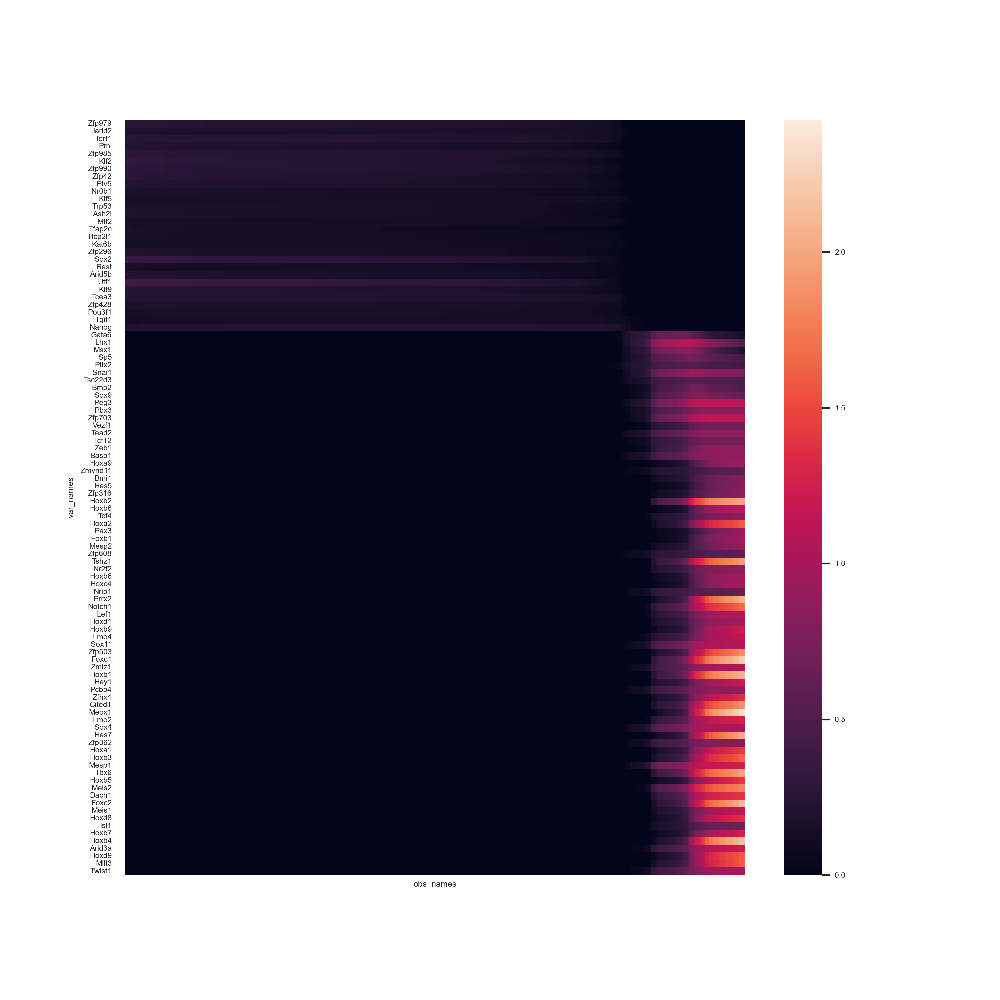
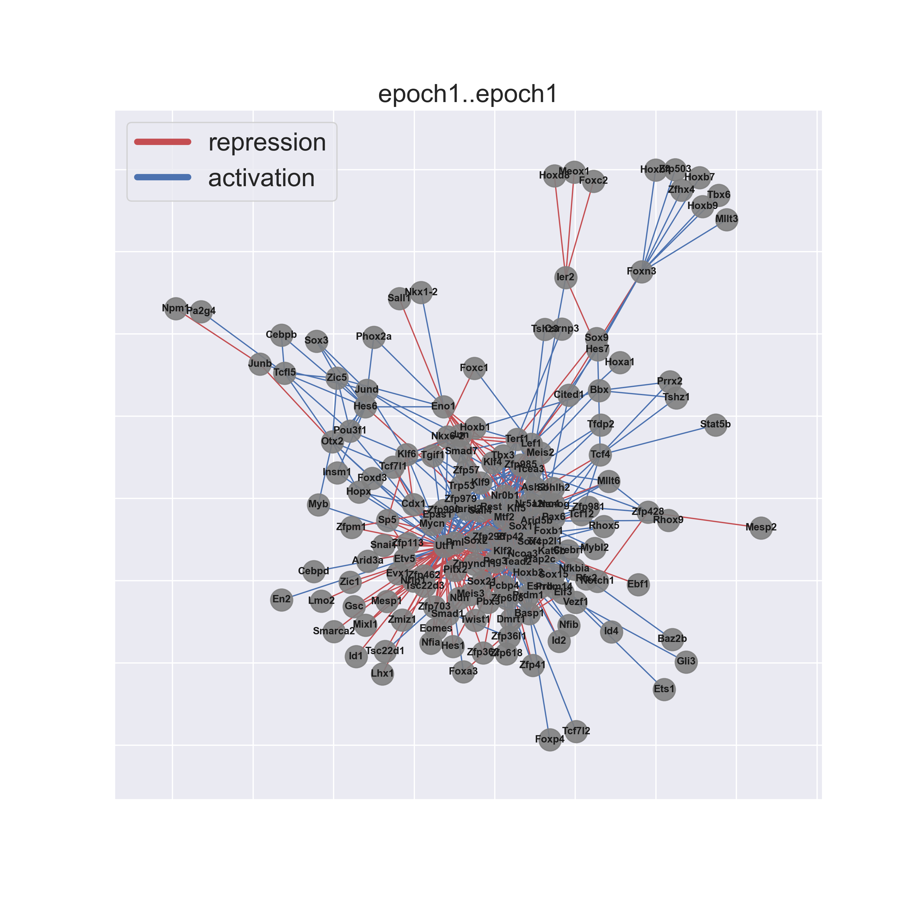
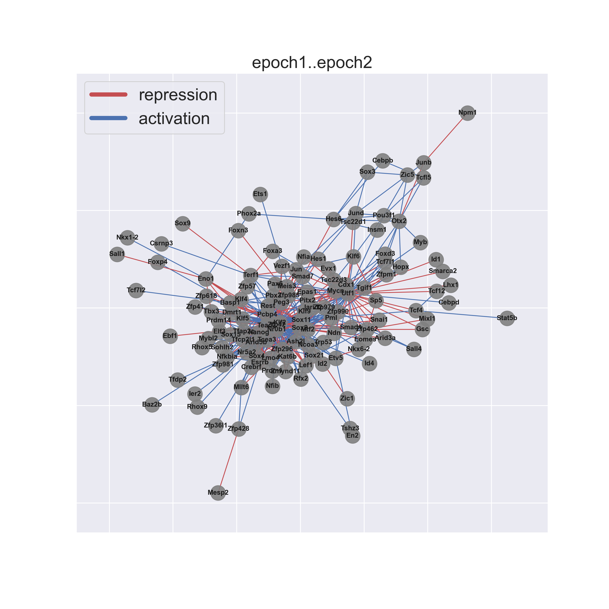
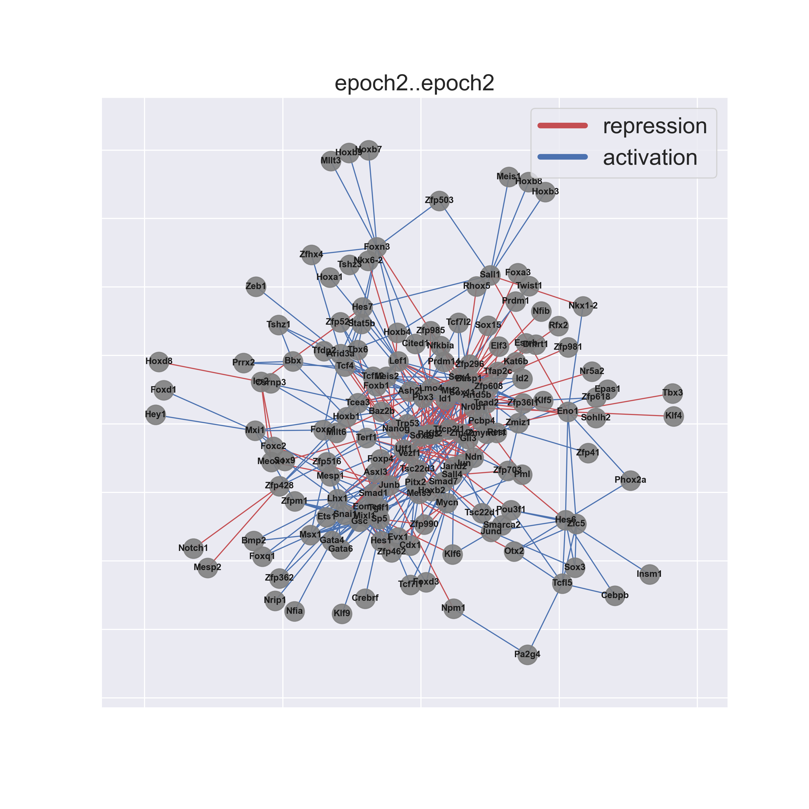

# pyEpoch

Dynamic gene regulatory network reconstruction from scRNA-seq data. See the original R version [here](https://github.com/pcahan1/epoch): 


## Introduction
Epoch leverages single-cell transcriptomic data, single-cell analysis methods, and graph theoretic approaches to reconstruct dynamic GRNs. Additionally, Epoch contains functionality for top regulator prediction, network comparision, signaling pathway integration, amongst others. Here we show some examples of Epoch in action.

For a more in depth look at Epoch, and to see how we applied it to elucidate signaling-induced GRN topology changes in early mouse embryonic stem cell (ESC) directed differentiation, check out our [preprint here](https://www.biorxiv.org/content/10.1101/2021.05.06.443021v2).


The datasets used in the following examples are available in the Data folder.

1. [Example 0: The Basics, E12.5 Mouse Muscle Development](#example0)
2. [Example 1: Network Reconstruction and Signaling Integration, mESC Directed Differentiation](#example1)


## Example Walk Thru 0: The Basics <a name="example0"></a>
This is data from E12.5 mouse muscle development. Here we show the basics of Epoch-- how to use it to reconstruct and dynamic network. 

### Set up
```Python
import numpy as np
import pandas as pd
import scanpy as sc
import pyEpoch as Epoch

```
### Load Data

```Python
sc.settings.verbosity = 3             # verbosity: errors (0), warnings (1), info (2), hints (3)
sc.logging.print_header()
Epoch.set_figure_params(dpi=200, figsize = (10,10), facecolor='white')
adata=sc.read_loom("adMuscle_E12_DPT_071919.loom",sparse=False) #adata matrix cannot be sparse
adata.var_names=adata.var['var_names']
adata.obs_names=adata.obs['obs_names']

#sc.pp.normalize_total(adata, target_sum=1e4)
sc.pp.normalize_per_cell(adata, counts_per_cell_after=1e4)
sc.pp.log1p(adata)
sc.pp.scale(adata, max_value=10)

mmTFs=pd.read_csv("mmTFs_epoch.csv", header = None)
mmTFs=list(mmTFs[0].values)
```
### Static Network Reconstruction
Reconstruction occurs in three steps: 

1. Find dynamically expressed genes
2. Infer edges across dynamic genes using CLR (or other supported method)
3. Perform optional cross-weighting to refine network structure
``` Python
#Find Dynamically Expressed Genes
adata=Epoch.findDynGenes(adata, group_column="leiden",pseudotime_column="dpt_pseudotime")

# Optional: to analyze a subset of the data along a particular path you can specify the path
# adata=Epoch.findDynGenes(adata, group_column="leiden", path=['1','0'], pseudotime_column="dpt_pseudotime")

# Reconstruct and perform optional crossweighting
adata=Epoch.reconstructGRN(adata,mmTFs,zThresh=3)
adata=Epoch.crossweight(adata)
```
The reconstructed network is stored in adata.uns['grnDF']. TG and TF refer to target gene and transcription factor respectively. The column "zscore" is the network prior to crossweighting. The column "weighted_score" is the network after crossweighting:

```Python
print(adata.uns["grnDF"].iloc[0:5,:])

#     TG      TF    zscore      corr    offset  weighted_score
#0  Eya1    Myog  4.178345 -0.261096  2.365385        4.178345
#1  Eya1   Dmrt2  4.772928  0.213328 -2.346154        4.772928
#2  Eya1    Lbx1  3.556854  0.227854  1.365385        3.556854
#3   Msc    Myog  5.340096 -0.482617  3.500000        5.340096
#4   Msc  Cited1  5.910916  0.274095 -1.750000        5.910916
```

### Dynamic Network Extraction
We can further explore changes in the network across time by defining "epochs" or time periods in our trajectory, assigning genes to these epochs, and extracting a dynamic network across time.  

Defining epochs can be done in a number of ways. Here we show an example with method="pseudotime". This will partition cells based on pseudotime (pseudotime will be divided evenly, unless specified with parameter psuedotime_cuts). Althernatively, we can define epochs by "cell_order", in which cells are partitioned based on raw cell order rather than pseudotime, or "group", in which partitions are pre-defined.  

For a simpler approach, assign_epoch_simple() will define and assign epochs based on maximum mean expression of a gene. This approach assumes genes cannot belong to more than one epoch.

```Python
adata=Epoch.define_epochs(adata,method="pseudotime",num_epochs=2)
adata=Epoch.assign_epochs(adata,method="active_expression")


adata=Epoch.epochGRN(adata)

#     from      to            name
#0  epoch1  epoch2  epoch1..epoch2
#1  epoch1  epoch1  epoch1..epoch1
#2  epoch2  epoch2  epoch2..epoch2


# Example alternative:
# adata=Epoch.assign_epochs_simple(adata[:,dgenes],num_epochs=2)
```
  The dynamic network across epochs is stored in adata.uns['dynamic_grn']. The list includes active subnetworks at each epoch (in this example, "epoch1..epoch1" and "epoch2..epoch2") as well as potential transition networks (in this example, "epoch1..epoch2") describing how network topology transitions from one epoch to another.


### Influential TFs
We can use Epoch to identify the most influential regulators in the reconstructed dynamic (or static) network. Here's an example of accomplishing this via a PageRank approach on the dynamic network. 

```Python
adata=Epoch.compute_pagerank(adata,weight_column="weighted_score")
```
adata.uns['pagerank'] now contains a list of rankings for each epoch and transition network:

```Python
print(adata.uns["pagerank"]["epoch1..epoch2"].iloc[0:5,:])
#        gene  page_rank  is_regulator
#Npm1    Npm1   0.062243          True
#Pcna    Pcna   0.061330          True
#Myod1  Myod1   0.049656          True
#Ncl      Ncl   0.045162          True
#Hes6    Hes6   0.030157          True
```

We can also use betweenness and degree.
```Python
adata=Epoch.compute_betweenness_degree(adata,weight_column="zscore")
```
adata.uns["betweenness_degree"] now contains a list of rankings for each epoch and transition network:

```Python
print(adata.uns["betweenness_degree"]["epoch1..epoch2"].iloc[0:5,:])
#       gene  betweenness    degree  betweenness*degree  is_regulator
# Npm1  Npm1     0.406670  0.351351            0.142884          True
# Ybx1  Ybx1     0.178786  0.189189            0.033824          True
# Ncl    Ncl     0.125459  0.151767            0.019041          True
# Msc    Msc     0.131436  0.143451            0.018855          True
# Myf5  Myf5     0.090402  0.120582            0.010901          True
```


### Plotting
Epoch contains various plotting tools to visualize dynamic activity of genes and networks.


#### We can visualize dynamically expressed genes across time
This is particularly useful for verifying epoch assignments, and gauging how many epochs should occur in a trajectory
```Python
# First, smooth expression for a cleaner plot
adata=Epoch.grnKsmooth(adata,BW=.1)

# Plot a heatmap of the dynamic TFs
Epoch.hm_dyn(adata,limit_to = mmTFs,topX=100)
```


```Python
Epoch.plot_dynamic_network(adata,only_TFs=True,order=["epoch1..epoch1","epoch1..epoch2","epoch2..epoch2"])
```


## Example Walk Thru 1: Network Reconstruction and Signaling integration <a name="example1"></a>
This data is unpublished data from our lab. It is sampled from day 0 through day 4 mESC directed differentiation toward mesodermal fate guided by Wnt3a, Activin A, and GSKi. It has already been normalized, and the varying genes have been identified. It has also been clustered, and analyzed with RNA Velocity.

### Set up
```Python
import numpy as np
import pandas as pd
import scanpy as sc
import pyEpoch as Epoch

```
### Load Data

```Python
sc.settings.verbosity = 3             # verbosity: errors (0), warnings (1), info (2), hints (3)
sc.logging.print_header()
Epoch.set_figure_params(dpi=200, figsize = (10,10), facecolor='white')
```
```Python
adata=sc.read_loom("sampled_mesoderm_WAG.loom",sparse=False) #adata matrix cannot be sparse
adata.var_names=adata.var['var_names']
adata.obs_names=adata.obs['obs_names']
# adata.X = adata.X.todense()

sc.pp.normalize_per_cell(adata, counts_per_cell_after=1e4)
sc.pp.log1p(adata)
sc.pp.scale(adata, max_value=10)

mmTFs=pd.read_csv("mmTFs_epoch.csv", header = None)
mmTFs=list(mmTFs[0].values)
```
### Static Network Reconstruction
Reconstruction occurs in three steps: 

1. Find dynamically expressed genes
2. Infer edges across dynamic genes using CLR (or other supported method)
3. Perform optional cross-weighting to refine network structure
``` Python
#Find Dynamically Expressed Genes
adata=Epoch.findDynGenes(adata, group_column="cluster",pseudotime_column="latent_time")

# Reconstruct and perform optional crossweighting
adata=Epoch.reconstructGRN(adata,mmTFs,zThresh=3)
adata=Epoch.crossweight(adata)
```
The reconstructed network is stored in adata.uns['grnDF']. TG and TF refer to target gene and transcription factor respectively. The column "zscore" is the network prior to crossweighting. The column "weighted_score" is the network after crossweighting:

```Python
print(adata.uns["grnDF"].iloc[0:5,:])

```

### Dynamic Network Extraction
Here we define and assign epochs based on pseudotime. For more options see example 0 above. 

```Python
adata=Epoch.define_epochs(adata,method="pseudotime",num_epochs=3)
adata=Epoch.assign_epochs(adata,method="active_expression")


adata=Epoch.epochGRN(adata)

```
The dynamic network across epochs is stored in adata.uns['dynamic_grn'].


### Influential TFs
```Python
adata=Epoch.compute_pagerank(adata,weight_column="weighted_score")
```
adata.uns['pagerank'] now contains a list of rankings for each epoch and transition network.

```Python
print(adata.uns["pagerank"]["epoch1..epoch2"].iloc[0:5,:])
#           gene  page_rank  is_regulator
# Utf1      Utf1   0.065106          True
# Zfp42    Zfp42   0.056393          True
# Klf2      Klf2   0.055411          True
# Sox2      Sox2   0.040435          True
# Arid5b  Arid5b   0.027446          True

```

We can also use betweenness and degree.
```Python
adata=Epoch.compute_betweenness_degree(adata,weight_column="zscore")
```
adata.uns["betweenness_degree"] now contains a list of rankings for each epoch and transition network:

```Python
print(adata.uns["betweenness_degree"]["epoch1..epoch2"].iloc[0:5,:])
#           gene  betweenness    degree  betweenness*degree  is_regulator
# Utf1      Utf1     0.268425  0.484444            0.130037          True
# Zfp42    Zfp42     0.170674  0.487407            0.083188          True
# Klf2      Klf2     0.156712  0.514074            0.080561          True
# Sox2      Sox2     0.186447  0.416296            0.077617          True
# Arid5b  Arid5b     0.053685  0.275556            0.014793          True
```

### Plotting
Epoch contains various plotting tools to visualize dynamic activity of genes and networks.


#### We can visualize dynamically expressed genes across time
This is particularly useful for verifying epoch assignments, and gauging how many epochs should occur in a trajectory
```Python
# First, smooth expression for a cleaner plot
adata=Epoch.grnKsmooth(adata,BW=.1)

# Plot a heatmap of the dynamic TFs
Epoch.hm_dyn(adata,limit_to = mmTFs,topX=100)
```


```Python
Epoch.plot_dynamic_network(adata,only_TFs=True,order=["epoch1..epoch1","epoch1..epoch2","epoch2..epoch2"])
```






## Example Walk Thru 2: Network Comparison <a name="example2"></a>
We can use PyEpoch to compare networks. Here's an example of doing so at the edge level. In this instance we use PyEpoch to extract "differential networks".

Starting with the network we reconstructed in Example 0, we can compare it to a network reconstructed using data collected from mESC directed differentiation toward mesoderm guided by a separate treatment. Alternatively, such a method may be used to compare in vitro networks with in vivo networks.

### Data
In this section, PyEpoch requires at least two reconstructed networks (in order to carry out the comparison) and the epoch assignments for these networks. These inputs are derived from the reconstruction in previous sections.

First, load in the data. The reconstructed network and epoch assignments from the previous section are provided here as 'net1' and epochs1':
```Python
# load in two anndata instances
adata2=sc.read_h5ad("example1_anndata.h5ad")
adata3=sc.read_h5ad("example2_anndata.h5ad")
```

### Compute the differential network
We can compute the differential network between network1 (GRN reconstructed in Example 1) and network2 (GRN just loaded in).

```Python
# Run edge_uniqueness to tally differences in edges
res = Epoch.edge_uniqueness([adata2.uns['dynamic_GRN'],adata3.uns['dynamic_GRN']],mmTFs,weight_column="weighted_score")

# Run dynamic_difference_network to extract the dynamic differential network
network1_on = Epoch.dynamic_difference_network(res, adata2, adata3, "network1", types="on", diff_thresh=7.5, condition_thresh=10)

# Add interaction type
network1_on = Epoch.add_interactions_types(network1_on,"on",adata2.uns['dynamic_GRN'],[adata3.uns['dynamic_GRN']])
```
The edges in the resulting differential network are those that are differentially active in network 1. We can tune the threshold "diff_thresh" to increase or decrease the difference threshold at which an edge is considered differentially active. We can tune the threshold "condition_thresh" to change the threshold at which an edge is considered active in a given network.

The weight_column parameter in edge_uniquness can be changed to reflect the proper edge weight. For example, other metrics of importance can be used in place of the crossweighted score, such as degree product.

This is what the differential network looks like:


## Example 3: Signaling Pathway Integration <a name="example3"></a>
We can use PyEpoch to integrate signaling activity and trace paths through the network. Starting with the dynamic network we constructed in Example 1.

### Data
In this section, PyEpoch requires a reconstructed network (which can be derived from Example 1: Reconstruction. As described below, PyEpoch will also require pre-computed effector targets.

After reconstruction:

```Python
expMat = Epoch.makeExpMat(adata)
sampTab = Epoch.makeSampTab(adata)

dynamic_grn = adata.uns['dynamic_GRN']
```
### Get effector targets
Effector targets of major signaling pathways are pre-computed and available within PyEpoch (mouse: see 'data/effectortargets_mouse.rda'). These lists were computed by: (1) aquiring binding score (MACS2) data for 18 signaling effector TFs from the ChIP-Atlas (Oki et al., 2018), (2) target genes were ranked by maximum binding score, (3) the top 2000 targets were retained (or all retained, if less than 2000 targets).

Alternatively, here's how we can derive new effector target lists:
```Python
effectors = Epoch.load_SP_effectors(path="Data/mouse_signaling_binding")
effectors = Epoch.score_targets(effectors)
effectortargets = Epoch.find_targets(effectors,column="max_score",by_rank= True, n_targets=2000)

# Instead of "max_score", we could have also ranked by "mean_score" or "percent_freq".
# Instead of retaining the top n_targets, we could have also specified a cutoff threshold by specifying the 'threshold' parameter.
```

### Signaling pathway activity
We can estimate signaling activity over time by quantifying the expression of effector targets. As an example, let's look at Wnt signaling. Unsurprisingly, we see strong activity as cells progress toward mesodermal fate.

Alternatively, we could instead look at all pathways to understand differences in major signaling pathways between treatments, conditions, etc. (See manuscript for details)

```Python
# Wnt signaling
wnt_targets = {k: effectortargets[k] for k in ("WNT_Ctnnb1.1","WNT_Lef1.1","WNT_Tcf7.1","WNT_Tcf7l2.1")}

# lets separate by pre-treatment and treatment
# adding in the treatment information
ccells = adata.uns['cells']
ccells.set_index(ccells['cell_name'])
ccells = ccells.reindex(index = sampTab['obs_names'])
ccells.set_index(ccells['cell_name'])
ccells['treatment'] = sampTab['treatment']
adata.uns['cells'] = ccells

# compute mean module expression over time
adata = Epoch.mean_module_expression(adata,wnt_targets, "pre", "pre_exp")
adata = Epoch.mean_module_expression(adata,wnt_targets, "WAG", "WAG_exp")

#Add plotting
```
### Paths toward target genetic programs
Now that we have reconstructed a dynamic network and predicted effector target genes, we can integrate signaling pathway activity with the GRN. For example, we can trace the effects of Wnt signaling in activating a mesoderm-like program (or simply, some genes of interest).

```Python
# Some interesting mesoderm TFs, plus Sox17 (an endoderm TF)
interesting_genes = ["Mesp1","Foxc1","Foxc2","Tbx6","Sox17"]

# Paths from b-catenin to interesting genes
bcat_to_meso = dynamic_shortest_path_multiple(adata,effectortargets['WNT_Ctnnb1.1'],interesting_genes)

# Paths from Tcf7 to interesting genes
tcf7_to_meso = dynamic_shortest_path_multiple(adata,effectortargets['WNT_Tcf7.1'],interesting_genes)

# Paths from Tcf7l2 to interesting genes
tcf7l2_to_meso = dynamic_shortest_path_multiple(adata,effectortargets['WNT_Tcf7l2.1'],interesting_genes)
```
