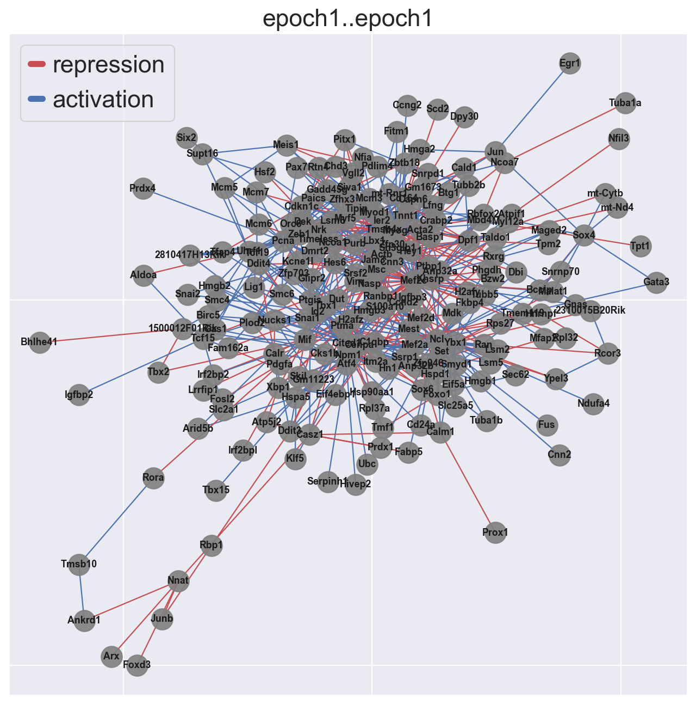
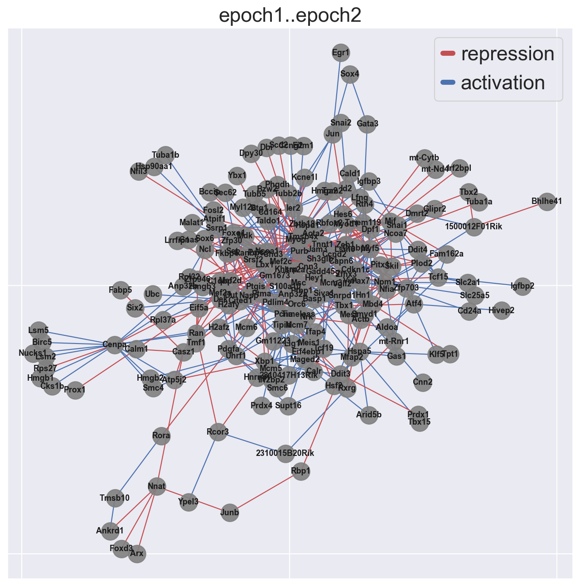
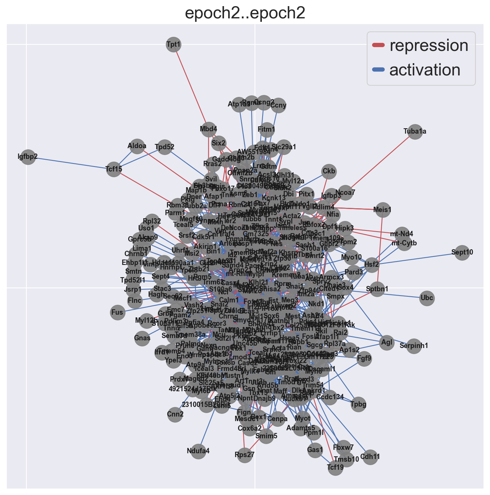

# pyEpoch

Gene regulatory network reconstruction from scRNA-seq data. This program was translated from R to Python to be compatible with SCAN-PY


## Introduction
Epoch leverages single-cell transcriptomic data, single-cell analysis methods, and graph theoretic approaches to elucidate GRN structure and dynamic activity. 

## Example Walk Thru 0: The Basics

### Set up
```Python
import numpy as np
import pandas as pd
import scanpy as sc

```
### Load Data

```Python
sc.settings.verbosity = 3             # verbosity: errors (0), warnings (1), info (2), hints (3)
sc.logging.print_header()
sc.settings.set_figure_params(dpi=80, facecolor='white')

adata=sc.read_loom("adMuscle_E12_DPT_071919.loom",sparse=False)

sc.pp.normalize_total(adata, target_sum=1e4)
sc.pp.log1p(adata)
sc.pp.scale(adata, max_value=10)

#create and name data frames
genes=adata.var.index
sampTab=pd.DataFrame(adata.obs)
cells=list(sampTab.index.values)

expDat=pd.DataFrame(adata.X).T
expDat.columns=sampTab.index
expDat.index=genes

expDat=expDat.loc[expDat.sum(axis=1)!=0]
expDat.index=genes


mmTFs=pd.read_csv("mmTFs")
mmTFs=list(mmTFs["mmTFs"].values)
```
### Static Network Reconstruction
Reconstruction occurs in three steps: 

1. Find dynamically expressed genes
2. Infer edges across dynamic genes using CLR (or other supported method)
3. Perform optional cross-weighting to refine network structure
``` Python
#Find Dynamically Expressed Genes
xdyn=findDynGenes(expDat, sampTab, group_column="leiden",pseudotime_column="dpt_pseudotime")
pThresh=0.05
DataFrameGenes=pd.DataFrame(xdyn[0]["expression"]<pThresh)
dgenes=DataFrameGenes[DataFrameGenes["expression"]==True].index.values

# Reconstruct and perform optional crossweighting
grnDF=reconstructGRN(expDat.loc[dgenes,:],mmTFs,zThresh=3)
grnDF=crossweight(grnDF,expSmoothed=expDat)
```
The object grnDF contains the reconstructed network. TG and TF refer to target gene and transcription factor respectively. The column "zscore" is the network prior to crossweighting. The column "weighted_score" is the network after crossweighting:

```Python
print(grnDF.iloc[0:5,:])

#     TG      TF    zscore      corr    offset  weighted_score
#0  Eya1    Myog  4.178345 -0.261096  2.365385        4.178345
#1  Eya1   Dmrt2  4.772928  0.213328 -2.346154        4.772928
#2  Eya1    Lbx1  3.556854  0.227854  1.365385        3.556854
#3   Msc    Myog  5.340096 -0.482617  3.500000        5.340096
#4   Msc  Cited1  5.910916  0.274095 -1.750000        5.910916
```

### Dynamic Network Extraction
We can further explore changes in the network across time by defining "epochs" or time periods in our trajectory, assigning genes to these epochs, and extracting a dynamic network across time.  

Defining epochs can be done in a number of ways. Here we show an example with method="pseudotime". This will partition cells based on pseudotime (pseudotime will be divided evenly, unless specified with parameter psuedotime_cuts). Althernatively, we can define epochs by "cell_order", in which cells are partitioned based on raw cell order rather than pseudotime, or "group", in which partitions are pre-defined.  

For a simpler approach, assign_epoch_simple() will define and assign epochs based on maximum mean expression of a gene. This approach assumes genes cannot belong to more than one epoch.

```Python
xdyn=define_epochs(xdyn,expDat.loc[dgenes,:],method="pseudotime",num_epochs=2)
epoch_assignments=assign_epochs(expSmoothed=expDat.loc[dgenes,], xdyn=xdyn, method="active_expression")


dynamic_grn=epochGRN(grnDF, epoch_assignments)

#     from      to            name
#0  epoch1  epoch2  epoch1..epoch2
#1  epoch1  epoch1  epoch1..epoch1
#2  epoch2  epoch2  epoch2..epoch2


# Example alternative:
# epoch_assignments=assign_epochs_simple(expSmoothed=expDat.loc[dgenes,],xdyn=xdyn,num_epochs=2)
```
  The object dynamic_grn stores the dynamic network across epochs. The list includes active subnetworks at each epoch (in this example, "epoch1..epoch1" and "epoch2..epoch2") as well as potential transition networks (in this example, "epoch1..epoch2") describing how network topology transitions from one epoch to another.


### Influential TFs
We can use Epoch to identify the most influential regulators in the reconstructed dynamic (or static) network. Here's an example of accomplishing this via a PageRank approach on the dynamic network. 

```Python
gene_rank=compute_pagerank(dynnet=dynamic_grn)
```
The object gene_rank now contains a list of rankings for each epoch and transition network:

```Python
print(gene_rank["epoch1..epoch2"].iloc[0:5,:])
#        gene  page_rank  is_regulator
#Npm1    Npm1   0.062243          True
#Pcna    Pcna   0.061330          True
#Myod1  Myod1   0.049656          True
#Ncl      Ncl   0.045162          True
#Hes6    Hes6   0.030157          True
```
### Plotting
Epoch contains various plotting tools to visualize dynamic activity of genes and networks.


#### We can visualize dynamically expressed genes across time
This is particularly useful for verifying epoch assignments, and gauging how many epochs should occur in a trajectory
```Python
# First, smooth expression for a cleaner plot
ccells=xdyn[1]
expSmoothed=grnKsmooth(expDat,ccells,BW=.1)

# Plot a heatmap of the dynamic TFs
tfstoplot=list(set(mmTFs)& set(dgenes))
dynTFs=xdyn
dynTFs[0]=dynTFs[0][list(dynTFs[0].index.isin(tfstoplot))]
hm_dyn(expSmoothed,dynTFs,topX=100)
```


```Python
plot_dynamic_network(dynamic_grn,mmTFs,only_TFs=True,order=["epoch1..epoch1","epoch1..epoch2","epoch2..epoch2"])
```





