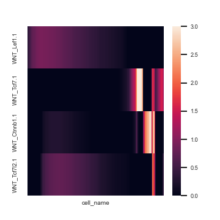

# pyEpoch

Dynamic gene regulatory network reconstruction from scRNA-seq data. See the original R version [here](https://github.com/pcahan1/epoch): 


## Introduction
Epoch leverages single-cell transcriptomic data, single-cell analysis methods, and graph theoretic approaches to reconstruct dynamic GRNs. Additionally, Epoch contains functionality for top regulator prediction, network comparision, signaling pathway integration, amongst others. Here we show some examples of Epoch in action.

For a more in depth look at Epoch, and to see how we applied it to elucidate signaling-induced GRN topology changes in early mouse embryonic stem cell (ESC) directed differentiation, check out our [publication here][1].

[1]: https://www.cell.com/stem-cell-reports/fulltext/S2213-6711(21)00657-3


The datasets used in the following examples are available in the Data folder.

1. [Example 1: The Basics, Reconstruction](#example1)
2. [Example 2: Network Comparison](#example2)
3. [Example 3: Signaling Pathway Integration](#example3)


## Example 1: The Basics <a name="example1"></a>
Epoch reconstructs networks from single-cell RNA-sequencing data. 

This data is sampled from day 0 through day 4 mESC directed differentiation toward mesodermal fate guided by Wnt3a, Activin A, and GSKi. It has already been normalized, and the varying genes have been identified. It has also been clustered, and analyzed with RNA Velocity.

### Set up
```Python
import numpy as np 
import pandas as pd 
import scanpy as sc 
sc.settings.verbosity = 3
sc.logging.print_versions()

import pyEpoch as epoch

epoch.set_figure_params(dpi=150, figsize = (5,5), facecolor='white')

```
### Load Data

```Python
adata=sc.read_loom("Data/sampled_mesoderm_WAG.loom",sparse=False) #adata matrix should not be sparse
adata.var_names=adata.var['var_names']
adata.obs_names=adata.obs['obs_names']

mmTFs=pd.read_csv("Data/mmTFs_epoch.csv", header = None)
mmTFs=list(mmTFs[0].values)
```
### Static Network Reconstruction
Reconstruction occurs in three steps: 

1. Find dynamically expressed genes
2. Infer edges across dynamic genes using CLR (or other supported method)
3. Perform optional cross-weighting to refine network structure
``` Python
#Find Dynamically Expressed Genes
adata=epoch.findDynGenes(adata, group_column="cluster",pseudotime_column="latent_time")

# Optional: to analyze a subset of the data along a particular path you can specify the path
# adata=Epoch.findDynGenes(adata, group_column="leiden", path=['1','0'], pseudotime_column="dpt_pseudotime")

# Reconstruct and perform optional crossweighting
adata=epoch.reconstructGRN(adata,mmTFs,zThresh=3)
adata=epoch.crossweight(adata)
```
The reconstructed network is stored in adata.uns['grnDF']. TG and TF refer to target gene and transcription factor respectively. The column "zscore" is the network prior to crossweighting. The column "weighted_score" is the network after crossweighting:

```Python
# >>> adata.uns['grnDF']
#              TG      TF    zscore      corr  offset  weighted_score
# 0      Kcnq1ot1   Mesp1  3.179528  0.171965  -14.76        3.179528
# 1      Kcnq1ot1  Zfp503  4.978477  0.199588   14.56        2.640199
# 2      Kcnq1ot1   Hoxb2  3.306813  0.178227    2.69        3.306813
# 3      Kcnq1ot1    Peg3  4.679305  0.201127  -26.24        4.679305
# 4      Kcnq1ot1   Hoxb3  3.305158  0.167221   11.11        2.120632
# ...         ...     ...       ...       ...     ...             ...
# 11957      Flnb    Lhx1  7.565501  0.336860   10.10        5.100612
# 11958     Pla1a    Elf3  3.466938  0.282784   -1.93        3.466938
# 11959     Pla1a  Tfap2c  6.940367  0.389504   -0.99        6.940367
# 11960     Pla1a   Sox15  4.781239  0.325625    7.32        4.781239
# 11961     Pla1a  Zfp296  5.557560  0.337089    3.91        5.557560
```

### Dynamic Network Extraction
We can further explore changes in the network across time by defining "epochs" or time periods in our trajectory, assigning genes to these epochs, and extracting a dynamic network across time.  

Defining epochs can be done in a number of ways. Here we show an example with method="pseudotime". This will partition cells based on pseudotime (pseudotime will be divided evenly, unless specified with parameter psuedotime_cuts). Althernatively, we can define epochs by "cell_order", in which cells are partitioned based on raw cell order rather than pseudotime, or "group", in which partitions are pre-defined.  

For a simpler approach, assign_epoch_simple() will define and assign epochs based on maximum mean expression of a gene. This approach assumes genes cannot belong to more than one epoch.

```Python
adata=epoch.define_epochs(adata,method="pseudotime",num_epochs=3)
adata=epoch.assign_epochs(adata,method="active_expression")

adata=epoch.epochGRN(adata)

# Example alternative:
# adata=Epoch.assign_epochs_simple(adata[:,dgenes],num_epochs=2)
```
  The dynamic network across epochs is stored in adata.uns['dynamic_GRN']. The list includes active subnetworks at each epoch (in this example, e.g. "epoch1..epoch1" and "epoch2..epoch2") as well as potential transition networks (in this example, e.g. "epoch1..epoch2") describing how network topology transitions from one epoch to another.

```Python
# >>> adata.uns['dynamic_GRN']
# {'epoch1..epoch2':            
# TG      TF    zscore      corr  offset  weighted_score
# 23      Pkdcc    Utf1  4.708074 -0.339445  -43.12        4.708074
# 48       Spp1  Zfp979  3.814013  0.355697    2.89        3.814013
# 53       Spp1    Mtf2  4.744048  0.441166    5.33        4.744048
# 57       Spp1    Rest  3.949614  0.427036  -13.48        3.949614
# 59       Spp1    Npm1  3.188382 -0.235115    4.24        3.188382
# ...       ...     ...       ...       ...     ...             ...
# 11925  Fbxo15   Tgif1  3.168447  0.252114   11.50        1.993055
# 11927  Fbxo15   Ash2l  4.359506  0.411654   -2.45        4.359506
# 11930  Fbxo15    Mycn  5.420821  0.368978  -24.03        5.420821
# 11939  Fbxo15  Jarid2  4.508017  0.413576   -2.40        4.508017
# 11949   Stmn3    Eno1  3.503487  0.149293   -3.49        3.503487

# ...


# 'epoch3..epoch3':              
# TG      TF    zscore      corr  offset  weighted_score
# 0      Kcnq1ot1   Mesp1  3.179528  0.171965  -14.76        3.179528
# 1      Kcnq1ot1  Zfp503  4.978477  0.199588   14.56        2.640199
# 2      Kcnq1ot1   Hoxb2  3.306813  0.178227    2.69        3.306813
# 3      Kcnq1ot1    Peg3  4.679305  0.201127  -26.24        4.679305
# 4      Kcnq1ot1   Hoxb3  3.305158  0.167221   11.11        2.120632
# ...         ...     ...       ...       ...     ...             ...
# 11933    Fbxo15  Zfp608  3.082031 -0.305910   -7.18        3.082031
# 11943      Irf2   Mllt3  3.783742  0.259658    3.49        3.783742
# 11944      Irf2   Meox1  4.013094  0.269818   10.31        2.678417
# 11945      Irf2    Sox4  3.129997  0.244706  -26.98        3.129997
# 11947   Serinc5   Basp1  3.083738 -0.109519   -5.34        3.083738

# [4970 rows x 6 columns]}

```


### Influential TFs
We can use Epoch to identify the most influential regulators in the reconstructed dynamic (or static) network. Here's an example of accomplishing this via a PageRank approach on the dynamic network. 

```Python
adata=epoch.compute_pagerank(adata,weight_column="weighted_score")
```
adata.uns['pagerank'] now contains a list of rankings for each epoch and transition network:

```Python
# >>> adata.uns['pagerank']['epoch1..epoch1']
#               gene  page_rank  is_regulator
# Utf1          Utf1   0.092602          True
# Rest          Rest   0.054220          True
# Mtf2          Mtf2   0.034427          True
# Eno1          Eno1   0.032023          True
# Ash2l        Ash2l   0.026821          True
# ...            ...        ...           ...
# B2m            B2m   0.000359         False
# Neat1        Neat1   0.000345         False
# Serpinh1  Serpinh1   0.000329         False
# Sdc4          Sdc4   0.000320         False
# Tcf4          Tcf4   0.000285         False

# [538 rows x 3 columns]
# >>> adata.uns['pagerank']['epoch3..epoch3']
#         gene  page_rank  is_regulator
# Tead2  Tead2   0.045068          True
# Sox11  Sox11   0.024751          True
# Peg3    Peg3   0.020098          True
# Basp1  Basp1   0.014608          True
# Sox4    Sox4   0.014592          True
# ...      ...        ...           ...
# Gdpd1  Gdpd1   0.000184         False
# App      App   0.000182         False
# Vldlr  Vldlr   0.000180         False
# Syt13  Syt13   0.000177         False
# Pkdcc  Pkdcc   0.000176         False

# [880 rows x 3 columns]

```

We can also use betweenness and degree.
```Python
adata=epoch.compute_betweenness_degree(adata,weight_column="weighted_score")
```
adata.uns["betweenness_degree"] now contains a list of rankings for each epoch and transition network:

```Python
# >>> adata.uns['betweenness_degree']['epoch3..epoch3']
#             gene  betweenness    degree  betweenness*degree  is_regulator
# Tead2      Tead2     0.224486  0.298066            0.066912          True
# Peg3        Peg3     0.114494  0.201365            0.023055          True
# Sox11      Sox11     0.087110  0.251422            0.021901          True
# Arid3a    Arid3a     0.158269  0.116041            0.018366          True
# Meis2      Meis2     0.075373  0.218430            0.016464          True
# ...          ...          ...       ...                 ...           ...
# Slc16a3  Slc16a3     0.000000  0.002275            0.000000         False
# Sycp3      Sycp3     0.000000  0.002275            0.000000         False
# Tgfb1i1  Tgfb1i1     0.000000  0.001138            0.000000         False
# Cald1      Cald1     0.000000  0.019340            0.000000         False
# P4ha2      P4ha2     0.000000  0.002275            0.000000         False
```

### Some Useful functions for networks

Here are some useful functions for understanding details of reconstructed networks.

First, we can add in the interaction type (also automatically added in plotting functions). This works on both static and dynamic GRNs (by specifying the grn parameter).


```Python

adata = epoch.add_interaction_type(adata)

# >>> adata.uns['dynamic_GRN']['epoch2..epoch2']
#             TG     TF    zscore      corr  offset  weighted_score interaction
# 8      S100a11    Ncl  4.532983 -0.225725  -24.85        4.532983  repression
# 35        Car2  Pa2g4  3.151107  0.216271   -7.19        3.151107  activation
# 36        Rbp1  Eomes  3.436444  0.260018   -0.59        3.436444  activation
# 37        Rbp1  Mixl1  3.609470  0.267141   -7.33        3.609470  activation
# 39        Rbp1   Evx1  5.257034  0.301897  -15.89        5.257034  activation
# ...        ...    ...       ...       ...     ...             ...         ...
# 11933  Tmem119   Peg3  5.689673  0.341408   24.19        1.249893  activation
# 11941   Pcsk1n   Npm1  4.568973 -0.198491   -0.24        4.568973  repression
# 11946    Stmn3   Eno1  3.503487  0.149293   -3.49        3.503487  activation
# 11950   Lrpap1  Tead2  3.611153 -0.271258   -7.37        3.611153  repression
# 11960    Aldoc    Ncl  5.713987 -0.307727  -12.67        5.713987  repression

```

We can apply community detection to these networks. This is particularly useful when examining mean module expression (see below). This works on both static and dynamic GRNs (by specifying the grn parameter).

```Python

adata = epoch.find_communities(adata)

# >>> adata.uns['dynamic_communities']['epoch3..epoch3']
#        genes  communities
# 0     Tmem37            1
# 1     Cited1            1
# 2      Lrig3            1
# 3     Mllt11            1
# 4     Twist1            1
# ..       ...          ...
# 875    Nolc1            8
# 876  S100a11            8
# 877     Ier2            8
# 878    Hells            8
# 879     Ccnf            8

```


### Plotting
Epoch contains various plotting tools to visualize dynamic activity of genes and networks.


#### We can visualize dynamically expressed genes across time
This is particularly useful for verifying epoch assignments, and gauging how many epochs should occur in a trajectory
```Python
# First, smooth expression for a cleaner plot
adata=epoch.grnKsmooth(adata,BW=.05)

# Plot a heatmap of the dynamic TFs
epoch.hm_dyn(adata,limit_to = mmTFs,topX=60)
```


```Python
epoch.set_figure_params(dpi=120, figsize = (6,7), facecolor='white')

epoch.plot_dynamic_network(adata,only_TFs=True,order=["epoch1..epoch1","epoch2..epoch2"])
```


## Example 2: Network Comparison <a name="example2"></a>

We can use Epoch to compare networks. Here's an example of doing so at the edge level. In this instance we use Epoch to extract "differential networks".  


Starting with the network we reconstructed in Example 1, we can compare it to a network reconstructed using data collected from mESC directed differentiation toward mesoderm guided by a separate treatment. Alternatively, such a method may be used to compare in vitro networks with in vivo networks.


### Data

In this section, Epoch requires at least two reconstructed networks (in order to carry out the comparison) and the epoch assignments for these networks. These inputs are derived from the reconstruction in the previous section.

First, load in the data. The reconstructed network and epoch assignments from the previous section are provided in the Data folder, "example2_network1.h5ad". A second network (and epochs) corresponding to a separate treatment (Wnt3a + Activin A only) is stored in "example2_network2.h5ad".

```Python
import numpy as np 
import pandas as pd 
import scanpy as sc 
sc.settings.verbosity = 3
sc.logging.print_versions()

import pyEpoch as epoch


adata1 = sc.read("Data/example2_network1.h5ad")
adata2 = sc.read("Data/example2_network2.h5ad")

```

### Compute the differential network

We can compute the differential network between adata1 (GRN reconstructed in Example 1) and adata2.


```Python
# Run edge_uniqueness to tally differences in edges
edgeDF = epoch.edge_uniqueness([adata1,adata2],weight_column="weighted_score")

# Run dynamic_difference_network to extract the dynamic differential network
# Condition is the column in edgeDF corresponding to the network of interest
network1_on = epoch.dynamic_difference_network(edgeDF, [adata1,adata2], condition="net1", diff_thresh=3, condition_thresh=5)

# Add interaction type if not already there. Here the interaction type is based on adata1
network1_on = epoch.add_diffnet_interaction_type(network1_on,adata1)


```

The edges in the resulting differential network are those that are differentially active in network 1. We can tune the threshold "diff_thresh" to increase or decrease the difference threshold at which an edge is considered differentially active. We can tune the threshold "condition_thresh" to change the threshold at which an edge is considered active in a given network.

The weight_column parameter in edge_uniquness can be changed to reflect the proper edge weight. For example, other metrics of importance can be used in place of the crossweighted score, such as degree product.

This is what the differential network looks like:
```Python
# >>> network1_on['epoch1']
#         TF       TG       net1      net2       diff      corr interaction
# 0    Cenpa    Cdc20  21.223806  0.000000  21.223806  0.501233  activation
# 1    Cenpa    Ccnb2  19.329182  0.000000  19.329182  0.387826  activation
# 2      Ncl    Ddx21  15.739036  0.000000  15.739036  0.426402  activation
# 3     Npm1    Rpl12  15.510649  0.000000  15.510649  0.423124  activation
# 4     Eno1  Tpd52l1  14.450582  0.000000  14.450582  0.437569  activation
# ..     ...      ...        ...       ...        ...       ...         ...
# 163   Rest    Fbxo5   5.002605  0.000000   5.002605  0.283712  activation
# 164   Rest    Esrrb   5.001846  0.000000   5.001846  0.417560  activation
# 165   Npm1    Srsf3   7.417003  3.014028   4.402975  0.295190  activation
# 166   Npm1   mt-Co1   8.440226  4.199126   4.241101 -0.311088  repression
# 167   Mycn     Sox2   8.709048  5.563160   3.145888  0.443418  activation

# [168 rows x 7 columns]
# >>> network1_on['epoch3']
#           TF      TG       net1      net2       diff      corr interaction
# 0     Hoxc10   Hoxc9  50.016526  0.000000  50.016526  1.000000  activation
# 1      Hoxc9  Hoxc10  50.016526  0.000000  50.016526  1.000000  activation
# 2       Hes5   Foxd1  38.706463  0.000000  38.706463  0.930722  activation
# 3      Hoxb5    Sox5  26.953262  0.000000  26.953262  0.608211  activation
# 4      Mesp2   Tgfb2  26.850631  0.000000  26.850631  0.660188  activation
# ...      ...     ...        ...       ...        ...       ...         ...
# 1053   Tead2   Acat2   6.227468  3.010311   3.217158  0.394627  activation
# 1054    Pbx3   Cd24a   6.341177  3.162692   3.178485  0.484916  activation
# 1055    Hey1  Atp1a2   6.688954  3.564338   3.124616  0.427787  activation
# 1056  Twist1    Prtg   6.694421  3.597892   3.096529  0.456101  activation
# 1057   Prrx2    Tbx6   6.533700  3.443107   3.090593  0.504463  activation

# [1058 rows x 7 columns]

```

#### Store the differential network into adata1
```Python
adata1.uns['diffnet_network1_on'] = network1_on

```


### Find communities

We can find community structure within the differential network (or other dynamic network). (Also mentioned above). This time we must specify which network to do community detection on. We can also specify where the communities are stored with communities_slot.

```Python
adata1 = epoch.find_communities(adata1,grn="diffnet_network1_on",communities_slot="diffnet_network1_communities")

# >>> adata1.uns['diffnet_network1_communities']
# {'epoch1':      genes  communities
# 0    Cenpa            1
# 1    Cdc20            1
# 2    Ccnb2            1
# 3     Hmmr            1
# 4    Mki67            1
# ..     ...          ...
# 141  Nr0b1           10
# 142  Tcea3           10
# 143  Capn3           10
# 144   Ier2           11
# 145   Rhou           11

# ...

# , 'epoch3':              genes  communities
# 0           Hoxc10            1
# 1            Hoxc9            1
# 2            Hoxa2            1
# 3           Cox4i2            1
# 4    2700033N17Rik            1
# ..             ...          ...
# 377          Lrig3           12
# 378           Yaf2           12
# 379          Acat2           12
# 380         Zfp608           13
# 381         Marcks           13

# [382 rows x 2 columns]}

```


### Plot the differential network

Similar to above, we can plot the differential network.
```Python
epoch.set_figure_params(dpi=120, figsize = (5,5), facecolor='white')

epoch.plot_dynamic_network(adata1,grn_name="diffnet_network1_on",only_TFs=True,order=["epoch2","epoch3"])

```


## Example 3: Signaling Pathway Integration <a name="example3"></a>

We can use Epoch to integrate signaling activity and trace paths through the network. Starting with the dynamic network we constructed in Example 1 and used in Example 2.


### Data

In this section, Epoch requires a reconstructed network (which can be derived from Example 1: Reconstruction <a name="example1"></a>. As described below, Epoch will also require pre-computed effector targets.


```Python
import numpy as np 
import pandas as pd 
import scanpy as sc 
sc.settings.verbosity = 3
sc.logging.print_versions()

import pyEpoch as epoch

adata1 = sc.read("Data/example2_network1.h5ad")

```

### Get Effector Targets

Effector targets of major signaling pathways are pre-computed and available within Epoch (mouse: see 'Data/effectortargets_mouse'). These lists were computed by: (1) aquiring binding score (MACS2) data for 18 signaling effector TFs from the ChIP-Atlas (Oki et al., 2018), (2) target genes were ranked by maximum binding score, (3) the top 2000 targets were retained (or all retained, if less than 2000 targets).

Alternatively, here's how we can derive new effector target lists:
```Python
effectors = epoch.load_SP_effectors(path="Data/mouse_signaling_binding")
effectors = epoch.score_targets(effectors)
effectortargets = epoch.find_targets(effectors,column="max_score",by_rank= True, n_targets=2000)

# Instead of "max_score", we could have also ranked by "mean_score" or "percent_freq".
# Instead of retaining the top n_targets, we could have also specified a cutoff threshold by specifying the 'threshold' parameter.

```


### Signaling pathway activity
We can estimate signaling activity over time by quantifying the expression of effector targets. As an example, let's look at Wnt signaling. Unsurprisingly, we see strong activity as cells progress toward mesodermal fate.

Alternatively, we could instead look at all pathways to understand differences in major signaling pathways between treatments, conditions, etc. (See manuscript for details)

For now, we can use the computed WNT effector targets:

```Python
wnt_targets = {k: effectortargets[k] for k in ("WNT_Ctnnb1.1","WNT_Lef1.1","WNT_Tcf7.1","WNT_Tcf7l2.1")}

# lets separate by pre-treatment and treatment
# adding in the treatment information

# compute mean module expression over time
adata1 = epoch.mean_module_expression(adata1,wnt_targets,result_name="wnt_activity")

# to limit this to a group of cells, update adata.uns['cell'] with additional labels, and set condition and condition_column parameters

```

We can plot this activity over time:

```Python
epoch.set_figure_params(dpi=120, figsize = (3,3), facecolor='white')

epoch.hm_module_expression(adata1.uns['wnt_activity'],smooth=True,BW=0.02,toScale=True,limits=[0,3])

```




### Paths toward target genetic programs
Now that we have reconstructed a dynamic network and predicted effector target genes, we can integrate signaling pathway activity with the GRN. For example, we can trace the effects of Wnt signaling in activating a mesoderm-like program (or simply, some genes of interest).

```Python
# Some interesting mesoderm TFs, plus Sox17 (an endoderm TF)
interesting_genes = ["Mesp1","Foxc1","Foxc2","Tbx6","Sox17"]

# Paths from b-catenin to interesting genes
bcat_to_meso = epoch.dynamic_shortest_path_multiple(adata1,effectortargets['WNT_Ctnnb1.1'],interesting_genes)

# Paths from Tcf7 to interesting genes
tcf7_to_meso = epoch.dynamic_shortest_path_multiple(adata1,effectortargets['WNT_Tcf7.1'],interesting_genes)

# Paths from Tcf7l2 to interesting genes
tcf7l2_to_meso = epoch.dynamic_shortest_path_multiple(adata1,effectortargets['WNT_Tcf7l2.1'],interesting_genes)
```

Here's what this looks like:

```Python
# >>> tcf7_to_meso
#      from     to                                 path  distance  distance_over_average  action_by_corr
# 0    Mtf2  Mesp1           [Mtf2, Tead2, Sox4, Mesp1]  2.721074               0.883953              -1
# 1    Mtf2  Foxc1         [Mtf2, Tead2, Arid3a, Foxc1]  2.789669               0.906236              -1
# 2    Mtf2  Foxc2  [Mtf2, Tead2, Arid3a, Foxc1, Foxc2]  3.548506               1.152748              -1
# 3    Mtf2   Tbx6          [Mtf2, Tead2, Arid3a, Tbx6]  2.752438               0.894142              -1
# 4   Mesp1  Mesp1                              [Mesp1]  0.000000               0.000000               1
# ..    ...    ...                                  ...       ...                    ...             ...
# 59   Pax2   Tbx6                  [Pax2, Prrx2, Tbx6]  1.792875               0.582424              -1
# 60  Sall4  Mesp1               [Sall4, Zfp703, Mesp1]  1.813454               0.589109               1
# 61  Sall4  Foxc1        [Sall4, Zfp703, Mesp1, Foxc1]  2.609879               0.847831              -1
# 62  Sall4  Foxc2        [Sall4, Zfp703, Mesp1, Foxc2]  2.705062               0.878751              -1
# 63  Sall4   Tbx6         [Sall4, Zfp703, Meis2, Tbx6]  2.688546               0.873386              -1

```


TF's in the column 'from' are targets of the effector TF Tcf7l2. Genes in the column "to" are targets from interesting_genes. The column 'path' describes the shortest path through the reconstructed network. The column 'distance_over_average' is the normalized distance (paths with values < 1 are shorter than the average path length).

By applying this method to dynamic networks reconstructed from different datasets, it's possible to elucidate topologies unsuitable or restrictive to specific cell fates. By apply this method more broadly via exhaustive search of paths from all major signaling effectors to specific sets of targets, it's possible to predict the necessary signaling activity required for directing specific cell fates.

(For more info on how we used this method to elucidate network topologies favoring mesodermal fate, to compare how activation and suppression of different signaling pathways impacts network topology, and a more in depth analysis on tracing paths from signaling effectors to target genes, see our [manuscript][1]).


